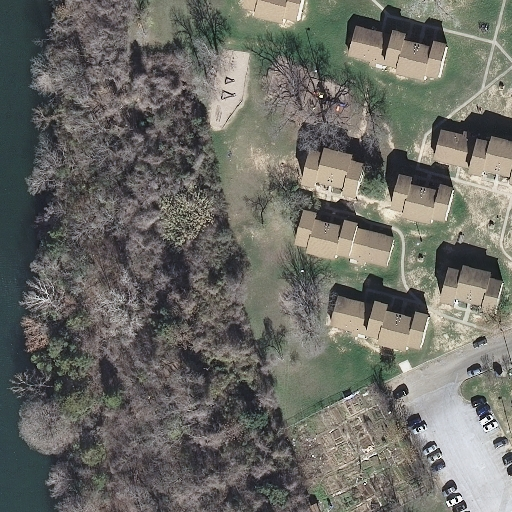
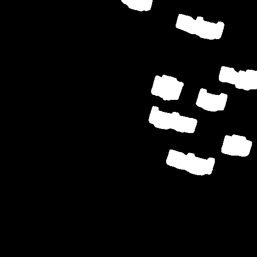
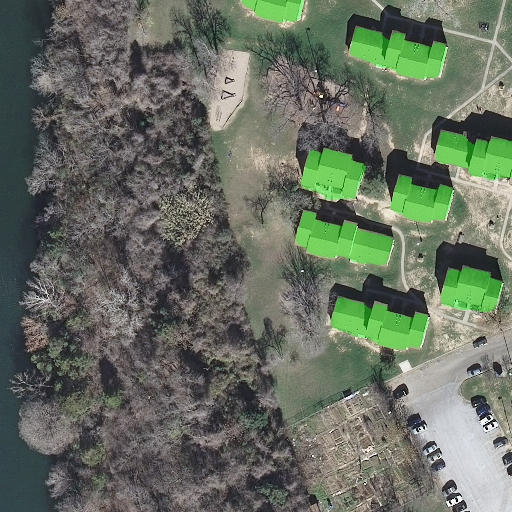

# 🏙️ Semantic Segmentation of Buildings from Aerial Imagery

**Final project for Deep Learning School @ MIPT (ФМПИ, МФТИ)**  
Semantic segmentation of buildings using satellite images from the **Inria Aerial Image Labeling Dataset**.

## 📌 Project Overview

This project tackles the task of segmenting building footprints from high-resolution aerial imagery.  
We use a custom U-Net model with a ResNet-34 encoder trained **from scratch** (no pretrained weights).

> 🔍 Goal: generate accurate binary masks of buildings from satellite images.

## 🚀 Try it yourself

You can test the model online:  
🔗 **[Streamlit Demo](https://geodatadls.streamlit.app/)** — upload your own image and get building masks in real time.

## 🖼️ Example Predictions

| Input Image |    Mask    | Input + Mask |
|-------------|------------|--------------|
|  |  |  |

## 🧠 Model Details

- **Architecture**: U-Net + ResNet-34 encoder
- **Loss Function**: Combined Dice Loss + Binary Cross Entropy (BCE)
- **Trained From Scratch**: No ImageNet weights used
- **Environment**: Google Colab, Kaggle

## 📊 Evaluation Metrics

- **IoU (Intersection over Union)**
- **F1-score**

📈 *(to be added below asap)*

## 📁 Project Structure

app.py — запуск Streamlit-приложения  
main_train.ipynb — обучение в Colab  
main_train_kaggle.ipynb — обучение в Kaggle  
requirements.txt — зависимости  
README.md — описание проекта  
configs/ — конфигурации проекта  
experiments/ — чекпойнты, логи, предсказания  
src/app/ — Streamlit-интерфейс и визуализация  
src/data/ — загрузка и обработка данных  
src/models/ — модель и функция потерь  
src/utils/ — метрики, сохранение, графики  
src/train.py — обучение модели  

## 💬 Citation / Credits

- **Dataset**: [Inria Aerial Image Labeling Dataset](https://project.inria.fr/aerialimagelabeling/)
- **Course**: [Deep Learning School, MIPT (ФМПИ МФТИ)](https://dls.samcs.ru/)
- **Author**: Evgenii Ilnitski